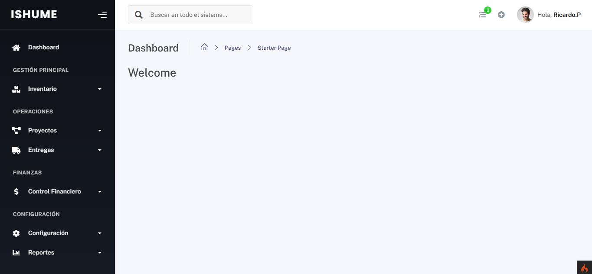
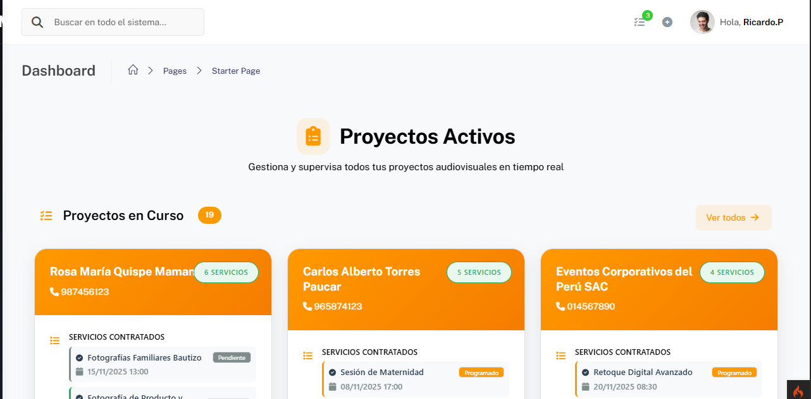

<div align="center">
  
  <h1>ISHUME - Sistema de Gestión de Eventos</h1>
  <p><strong>Sistema integral para gestión de servicios audiovisuales y eventos</strong></p>
  
  <p>
    
    
    
    
    
  </p>
</div>

---

## 📋 Descripción

**ISHUME** es un sistema completo de gestión empresarial diseñado específicamente para empresas de servicios audiovisuales y organización de eventos. Permite gestionar desde la cotización hasta la entrega final del servicio, con seguimiento en tiempo real y control de equipos técnicos.

### 🎯 Características Principales

- ✅ **Gestión de Clientes** - Personas y empresas con historial completo
- 📝 **Cotizaciones y Contratos** - Sistema de presupuestos y contratos digitales
- 🎬 **Servicios Audiovisuales** - Sonido, fotografía, iluminación, video, DJ, catering, decoración
- 👥 **Asignación de Personal** - Gestión de técnicos y equipos de trabajo
- 📊 **Tablero Kanban** - Seguimiento visual del estado de servicios (Programado → Pendiente → En Proceso → Completado)
- 💰 **Control de Pagos** - Gestión de pagos, adelantos y comprobantes
- 📦 **Gestión de Entregables** - Control de productos finales (fotos, videos, etc.)
- 📈 **Reportes y Estadísticas** - Dashboards con métricas de productividad
- 🔐 **Sistema de Roles** - Admin y Trabajador con permisos diferenciados
- 📱 **Diseño Responsive** - Interfaz moderna adaptable a dispositivos móviles

---

## 🚀 Tecnologías Utilizadas

### Backend
- **CodeIgniter 4** - Framework PHP MVC moderno
- **PHP 8.x** - Lenguaje de programación
- **MySQL 8.0** - Base de datos relacional
- **Composer** - Gestor de dependencias

### Frontend
- **Bootstrap 5.3** - Framework CSS responsive
- **JavaScript ES6+** - Programación del lado del cliente
- **SweetAlert2** - Alertas y notificaciones elegantes
- **Font Awesome** - Iconografía
- **FullCalendar** - Calendario interactivo

### Arquitectura
- **Patrón MVC** - Separación de responsabilidades
- **RESTful API** - Endpoints AJAX para operaciones asíncronas
- **Drag & Drop HTML5** - Tablero Kanban interactivo
- **Sistema de Roles (RBAC)** - Control de acceso basado en roles
- **Middleware/Filters** - Autenticación y autorización

---

## 📦 Instalación

### Requisitos Previos
```bash
- PHP >= 8.0
- MySQL >= 8.0
- Composer
- Apache/Nginx con mod_rewrite habilitado
```

### Pasos de Instalación

1. **Clonar el repositorio**
```bash
git clone https://github.com/xdasd13/appishume.git
cd appishume
```

2. **Instalar dependencias**
```bash
composer install
```

3. **Configurar base de datos**
```bash
# Copiar archivo de configuración
cp env .env

# Editar .env con tus credenciales
database.default.hostname = localhost
database.default.database = ishume_db
database.default.username = tu_usuario
database.default.password = tu_password
```

4. **Importar base de datos**
```bash
mysql -u tu_usuario -p ishume_db < app/Database/database.sql
```

5. **Configurar permisos**
```bash
chmod -R 777 writable/
```

6. **Iniciar servidor**
```bash
php spark serve
```

7. **Acceder al sistema**
```
URL: http://localhost:8080
Admin: admin@ishume.com / admin123
```

---

## 🗂️ Estructura del Proyecto

```
appishume/
├── app/
│   ├── Controllers/      # Controladores MVC
│   ├── Models/          # Modelos de datos
│   ├── Views/           # Vistas (HTML/PHP)
│   ├── Services/        # Lógica de negocio
│   ├── Filters/         # Middleware de autenticación
│   ├── Helpers/         # Funciones auxiliares
│   └── Database/        # Migraciones y seeds
├── public/
│   ├── assets/
│   │   ├── css/        # Estilos personalizados
│   │   ├── js/         # JavaScript modular
│   │   └── img/        # Imágenes y recursos
│   └── index.php       # Punto de entrada
├── writable/           # Logs y caché
└── vendor/             # Dependencias de Composer
```

---

## 👥 Módulos del Sistema

### 🔐 Autenticación y Usuarios
- Login con email/usuario y contraseña (bcrypt)
- Sistema de roles: Admin y Trabajador
- Gestión de usuarios y permisos
- Sesiones seguras con expiración

### 👤 Gestión de Clientes
- Registro de personas y empresas
- Historial de servicios contratados
- Información de contacto y ubicación

### 💼 Cotizaciones y Contratos
- Creación de presupuestos
- Gestión de contratos digitales
- Seguimiento de estados

### 🎬 Servicios Audiovisuales
- Catálogo de servicios disponibles
- Asignación de técnicos y equipos
- Programación de fechas y horarios

### 📊 Tablero Kanban
- Vista visual del flujo de trabajo
- Drag & Drop para cambiar estados
- Filtrado por usuario (trabajadores ven solo sus asignaciones)
- Validaciones de transición de estados
- Estadísticas en tiempo real

### 💰 Control de Pagos
- Registro de pagos y adelantos
- Generación de comprobantes
- Historial de transacciones

### 📦 Gestión de Entregables
- Control de productos finales
- Seguimiento de entregas
- Confirmación de recepción

### 📈 Reportes y Estadísticas
- Dashboard con métricas clave
- Reportes de productividad
- Historial de actividades

---

## 🔒 Seguridad Implementada

- ✅ **Autenticación robusta** con hash bcrypt
- ✅ **Protección CSRF** en formularios
- ✅ **Validación de entrada** en cliente y servidor
- ✅ **Middleware de autorización** por roles
- ✅ **Sesiones seguras** con expiración automática
- ✅ **Logging de actividades** críticas
- ✅ **Prevención de SQL Injection** con Query Builder
- ✅ **Validación de permisos** en múltiples capas

---

## 🎨 Paleta de Colores Corporativa

```css
--primary-color: #FF9900;      /* Naranja ISHUME */
--primary-dark: #F57C00;       /* Naranja oscuro */
--primary-light: #FFB74D;      /* Naranja claro */
--background: linear-gradient(#FFFFFF, #FFF8F0);
--text-primary: #2C3E50;
--text-secondary: #7F8C8D;
```

---

## 📱 Capturas de Pantalla

### Dashboard Principal


### Tablero Kanban


### Gestión de Servicios


---

## 🤝 Contribuir

Las contribuciones son bienvenidas. Por favor:

1. Fork el proyecto
2. Crea una rama para tu feature (`git checkout -b feature/AmazingFeature`)
3. Commit tus cambios (`git commit -m 'Add: Amazing Feature'`)
4. Push a la rama (`git push origin feature/AmazingFeature`)
5. Abre un Pull Request

---

## 📝 Licencia

Este proyecto está bajo la Licencia MIT. Ver el archivo `LICENSE` para más detalles.

---

## 👨‍💻 Autor

**Fabian Alonso**
- GitHub: [@xdasd13](https://github.com/xdasd13)
- Proyecto: [ISHUME](https://github.com/xdasd13/appishume)

---

<div align="center">
  <p>Hecho con ❤️ para la gestión eficiente de eventos</p>
  <p>⭐ Si te gusta el proyecto, dale una estrella en GitHub ⭐</p>
</div>